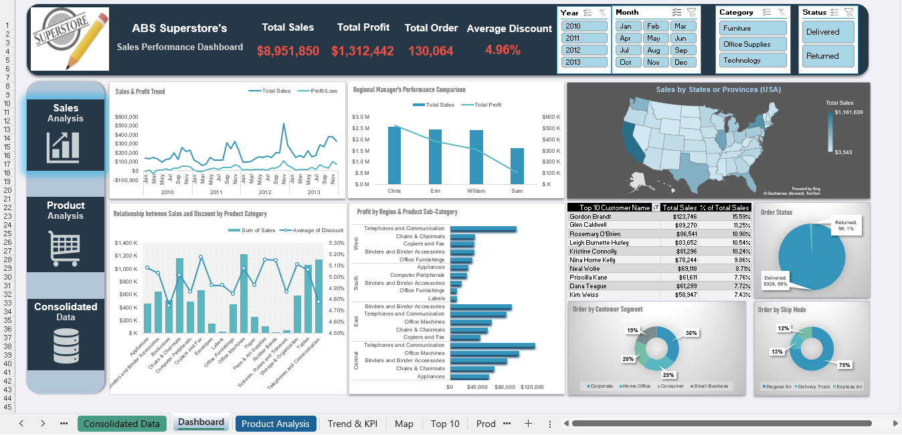

# ABS Superstore's Sales Performance Dashboard
## Author : Md Sobahan Mia

This project visualizes sales and performance data for ABS Superstore, focusing on trends, customer behavior, and product performance. The dashboard offers an interactive way to analyze key business metrics for data-driven decision-making.

## Dashboard Overview

The dashboard covers the years 2010 to 2013 and provides filters for easy data exploration. It includes insights into overall sales, profit, customer segmentation, regional performance, and product category performance.

### Key Metrics

- **Total Sales**: $8,951,850
- **Total Profit**: $1,312,442
- **Total Orders**: 130,064
- **Average Discount**: 4.96%

## Dashboard Components

1. **Sales & Profit Trend**
   - Visualizes monthly sales and profit trends from 2010 to 2013.
   - Shows peaks during certain periods, likely indicating promotions or seasonal sales.

2. **Regional Manager's Performance Comparison**
   - Compares total sales and profit by regional managers (Chris, Erin, William, Sam).
   - Chris leads in sales, while Sam has a lower profit margin, suggesting potential pricing or discounting issues in his region.

3. **Sales by State (USA)**
   - Heatmap highlighting sales distribution across states.
   - States with the highest sales are prominently displayed, with the top sales state reaching $1.16 million.

4. **Relationship Between Sales and Discount by Product Category**
   - Analyzes how discounts impact sales across categories.
   - High sales in Furniture and Office Supplies indicate strong demand even with moderate discounting.

5. **Profit by Region & Product Sub-Category**
   - Breaks down profitability by region and sub-category, showing the best-performing products in each region.
   - The Central region shows significant sales in Binders and Accessories, while the West region excels in Telephones and Communication.

6. **Top 10 Customers**
   - Lists top customers by sales amount, with Gordon Brandt and Glen Caldwell leading the contributions.
   - These top 10 customers account for a substantial portion of the total revenue.

7. **Order Status**
   - Pie chart showing the distribution of Delivered (92%) vs. Returned (8%) orders.
   - Highlights the need for improvements in order fulfillment and customer satisfaction.

8. **Order by Customer Segment**
   - Shows order breakdown by segments: Corporate, Home Office, Consumer, and Small Business.
   - Corporate customers are the largest segment, followed closely by Consumer orders.

9. **Order by Ship Mode**
   - Visualizes shipping preferences, with Regular Air as the most popular mode (75%).
   - Smaller proportions for Express Air and Delivery Truck may indicate cost-conscious choices among customers.

## Filters and Interactivity

The dashboard includes interactive filters for:
- **Year** (2010–2013)
- **Month** (Jan–Dec)
- **Category** (Furniture, Office Supplies, Technology)
- **Status** (Delivered, Returned)

These filters allow users to drill down into specific time periods, product categories, or order statuses for tailored insights.

## Key Insights

- **Sales Growth**: Positive trend in sales from 2010 to 2013, with spikes suggesting seasonal promotions.
- **Regional Performance**: High profitability in the Central region; potential for improvement in certain regions (e.g., Sam’s).
- **Customer Segment Focus**: Corporate customers dominate, indicating a B2B market emphasis.
- **Return Rate**: 8% returns suggest room for quality or service enhancements.

## How to Use the Dashboard

1. Clone the repository and open the dashboard in Power BI (or Excel if using Power Pivot).
2. Apply filters to explore specific segments based on analytical needs.
3. Review the visualizations to gain insights into sales trends, product performance, and customer behavior.

## Conclusion

This dashboard is a comprehensive tool for monitoring ABS Superstore’s sales and performance, guiding strategic decisions and improving customer segmentation and regional analysis.

